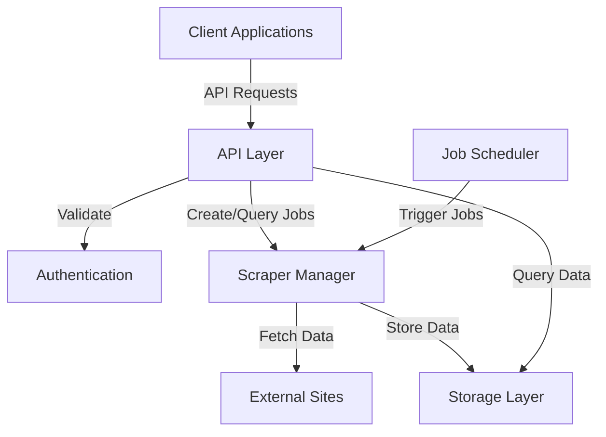
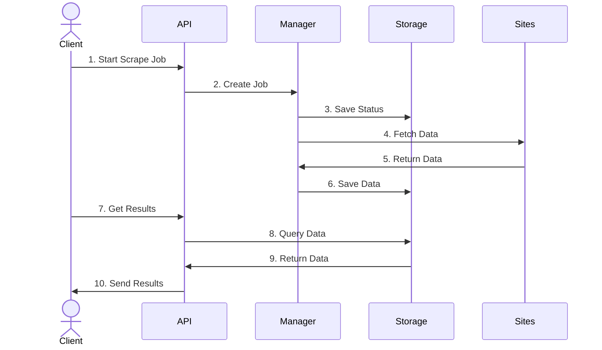

# Lead Generation Web Scraper - High Level Requirements

## 1. Business Requirements & User Stories

### 1.1 Primary Business Goals

- Identify automation opportunities in Canadian non-profits
- Gather comprehensive data about non-profit operations and needs
- Enable data-driven decision making for automation solutions

### 1.2 Core User Stories

1. As a researcher, I want to:

   - Automatically collect data about Canadian non-profits
   - Access collected data in a structured format
   - Track new organizations and changes over time

2. As a data analyst, I want to:

   - Filter organizations by various criteria
   - Export data for further analysis
   - Identify common automation needs

3. As a system administrator, I want to:
   - Monitor scraping job status
   - Ensure data collection complies with site policies
   - Manage API access

### 1.3 Success Criteria

- Reliable weekly data collection from specified sources
- Accurate organization and automation needs data
- Structured, deduplicated data storage
- Accessible data retrieval via API
- Scalable system design for future expansion

## 1.4 System Architecture Overview

### 1.4.1 Component Diagram

The following diagram shows the main components of the system and their interactions:

### 1.4.2 Sequence of Operations

The following diagram shows the sequence of operations for a typical scraping job:

### 1.4.3 Key Interactions

1. **Job Management**

   - Manual job initiation via API
   - Automated weekly scheduling
   - Job status tracking

2. **Data Collection**

   - Rate-limited external site scraping
   - Data validation and transformation
   - Deduplication during storage

3. **Data Access**
   - Filtered data retrieval
   - Status checking
   - Error handling and validation

## 2. Data Collection Requirements

### 2.1 Primary Data Sources

- Canadian Non-Profit Directories:
  - Canada Revenue Agency (CRA) Charities Listing
  - Imagine Canada
  - CharityVillage
  - CanadaHelps.org
- Professional Networks:
  - LinkedIn Canadian non-profit groups
  - Canadian Non-profit Technology Network
  - Ontario Nonprofit Network (ONN)
- Job Boards:
  - CharityVillage job postings
  - WorkInNonProfit.ca
  - Indeed Canada (non-profit filter)
- Industry Forums and Discussions:
  - Canadian Association of Gift Planners forums
  - AFP Canada discussions
  - Provincial non-profit association forums

### 2.2 Data Points to Collect

- Organization Information:
  - Organization name
  - Charitable registration number (if applicable)
  - Province/Territory
  - City
  - Organization size categories:
    - Staff count
    - Volunteer count
    - Annual revenue
    - Operating budget range
  - Primary cause/focus area
  - Year established
- Operational Information:
  - Current technology stack (if mentioned)
  - Administrative processes described
  - Grant application processes
  - Donor management systems
  - Volunteer coordination methods
  - Digital presence (website, social media)
- Automation Opportunities (categorized by area):
  - Administrative Tasks:
    - Data entry requirements
    - Document processing needs
    - Filing and record keeping
  - Financial Operations:
    - Bookkeeping processes
    - Donation processing
    - Expense tracking
    - Financial reporting
  - Program Management:
    - Impact measurement methods
    - Participant tracking
    - Service delivery tracking
  - Stakeholder Engagement:
    - Donor management
    - Volunteer coordination
    - Member communications
    - Event management
  - Compliance & Reporting:
    - CRA reporting requirements
    - Grant reporting processes
    - Program outcome tracking
- Technology Assessment:
  - Current software solutions
  - Pain points with existing systems
  - Manual processes identified
  - Integration needs
- Contact Information:
  - Public contact details
  - Key staff roles (Executive Director, Operations Manager, etc.)
  - Professional social media profiles

## 3. Technical Requirements

### 3.1 API & Features

- Core Architecture:

  - Headless API-first design
  - RESTful API endpoints
  - Weekly batch processing

- API Endpoints:
  - POST /api/v1/scrape
    - Initiate a new scraping job
    - Returns job ID for tracking
  - GET /api/v1/scrape/status/{jobId}
    - Get status of a specific scraping job
  - GET /api/v1/leads
    - Retrieve scraped leads
    - Support filtering and pagination
    - Optional CSV format export
  - GET /api/v1/leads/{leadId}
    - Retrieve specific lead details

### 3.2 Core Features

- Automated Data Collection:
  - Weekly scheduled scraping
  - Rate limiting and robots.txt compliance
  - Error handling and logging
- Data Processing:
  - Automatic deduplication
  - Data validation and sanitization
  - Structured data formatting
- Data Storage:
  - Local CSV storage (default)
  - Extensible storage interface
  - Basic querying capabilities

### 3.3 Data Validation

- Basic Validation:
  - URL validation
  - Email format verification
  - Phone number formatting
  - Required field checking
- Data Sanitization:
  - HTML stripping
  - Text normalization
  - Special character handling

### 3.4 Security & Rate Limiting

- API Authentication:
  - API key authentication
  - Basic rate limiting
- Compliance:
  - Respect for robots.txt
  - Adherence to site Terms of Service

### 3.5 Storage Abstraction

- Provider Interface Requirements:
  - Basic CRUD operations
  - Batch operation support
  - Deduplication functionality
  - Flexible querying capabilities
- Storage Provider Responsibilities:
  - Data persistence
  - Data retrieval with filtering
  - Duplicate detection
  - Error handling
- Implementation Requirements:
  - Support for multiple storage types
  - Consistent interface across providers
  - Easy provider switching
  - Data format consistency

## Questions for Further Refinement:

1. Should we prioritize non-profits of a particular size or annual revenue range?
2. Are there specific provinces we should focus on first?
3. Should we prioritize certain types of automation needs (e.g., donor management vs. volunteer coordination)?
4. What is the minimum viable dataset we need for each organization?
5. What authentication method should we implement for the API?
6. Should we implement webhook notifications for completed scraping jobs?
7. What should be the default rate limiting parameters?
8. What is the required data retention period?
9. What should be the format of the CSV files for local storage?
10. Should we implement any basic data compression for local storage?
11. What metrics should we track for monitoring scraping performance?
